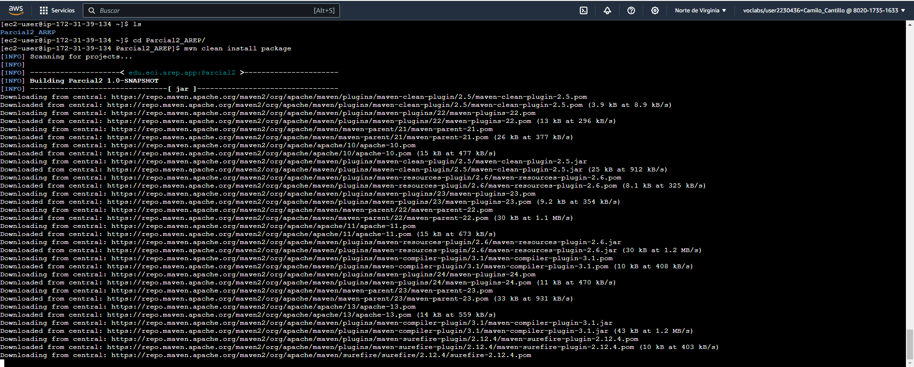

### Funcionamiento en Local


### Lanzamiento en nube

Creamos la instancia


instalamos Java, git y maven en nuestras instancias EC2

	 sudo yum install java-17-amazon-corretto.x86_64


  ```
  sudo yum install git -y
  ```
  ```
  sudo yum install maven -y
  ```

Clonamos el repositorio


```
  git clone https://github.com/CamiloCanta/Parcial2_AREP.git
  ```

Limpiamos el target

```
  mvn clean package install
  ```




Importante abrir los puertos en la configuracion de la instancia


corremos el comando siguiente en nuestra instancia para correr la aplicacion y luego probar

```
java -cp "target/classes:target/dependency/*" eci.escuelaing.edu.co.SparkLucas
```


### Video demo

[videodemo.mp4](src%2Fmain%2Fresources%2Fvideodemo.mp4)

### Autor
#### Camilo Andres Cantillo Tatis